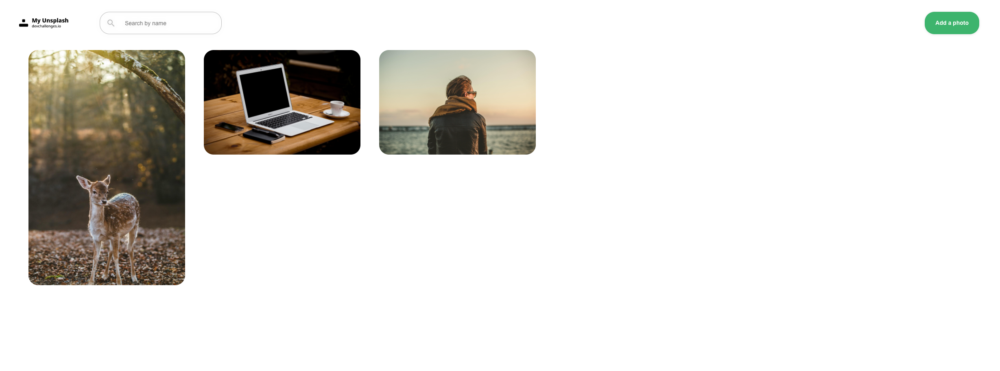

<!-- Please update value in the {}  -->

<h1 align="center">My Unsplash app with React and Firebase Realtime database</h1>

<div align="center">
   Solution for a challenge from  <a href="http://devchallenges.io" target="_blank">Devchallenges.io</a>.
</div>

<div align="center">
  <h3>
    <a href="https://sharp-hugle-07825d.netlify.app/">
      Demo
    </a>
    <span> | </span>
    <a href="https://github.com/dongtanhuy/dev-challenge-my-unsplash">
      Solution
    </a>
    <span> | </span>
    <a href="https://devchallenges.io/challenges/rYyhwJAxMfES5jNQ9YsP">
      Challenge
    </a>
  </h3>
</div>

<!-- TABLE OF CONTENTS -->

## Table of Contents

- [Overview](#overview)
  - [Built With](#built-with)
- [Features](#features)
- [How to use](#how-to-use)
- [Contact](#contact)
- [Acknowledgements](#acknowledgements)

<!-- OVERVIEW -->

## Overview



Introduce your projects by taking a screenshot or a gif. Try to tell visitors a story about your project by answering:

- Where can I see your demo?
  * You can take a look [here](https://sharp-hugle-07825d.netlify.app/) 
- What was your experience?
  * I am trying to apply Typescript a React project. So this is an opportunity for me to learn typescript with React
- What have you learned/improved?
  * I think using typescript takes me more time than using just javascript. However, I think it will help to reduce a lot of potential bugs related to Type checking

### Built With

<!-- This section should list any major frameworks that you built your project using. Here are a few examples.-->

- [React](https://reactjs.org/)
- [Redux](https://redux.js.org/)
- [Typescript](https://www.typescriptlang.org/)
- [Firebase](https://firebase.google.com/docs/database)

## Features

<!-- List the features of your application or follow the template. Don't share the figma file here :) -->

This application/site was created as a submission to a [DevChallenges](https://devchallenges.io/challenges) challenge. The [challenge](https://devchallenges.io/challenges/rYyhwJAxMfES5jNQ9YsP) was to build an application to complete the given user stories.

## How To Use

<!-- Example: -->

To clone and run this application, you'll need [Git](https://git-scm.com) and [Node.js](https://nodejs.org/en/download/) (which comes with [npm](http://npmjs.com)) installed on your computer. From your command line:

```bash
# Clone this repository
$ git clone https://github.com/dongtanhuy/dev-challenge-my-unsplash

# Install dependencies
$ yarn install

# Create .env.local file
$ nano .env.local
REACT_APP_FIREBASE_API_KEY=<Firebase API Key>
REACT_APP_FIREBASE_AUTH_DOMAIN=<Firebase Auth domain>
REACT_APP_FIREBASE_DATABASE_URL=<Firebase Database url>

# Run the app
$ yarn start
```

## Deploy
- [Netlify](https://www.netlify.com/)

## Acknowledgements

<!-- This section should list any articles or add-ons/plugins that helps you to complete the project. This is optional but it will help you in the future. For example: -->

- [Steps to replicate a design with only HTML and CSS](https://devchallenges-blogs.web.app/how-to-replicate-design/)
- [Node.js](https://nodejs.org/)
- [Marked - a markdown parser](https://github.com/chjj/marked)
- [How to deploy with Netlify](https://dev.to/easybuoy/deploying-react-app-from-github-to-netlify-3a9j)
- [Firebase Database and React tutorial](https://codesource.io/understanding-firebase-realtime-database-using-react/)

## Contact

- Website [www.juliandong.com](https://www.juliandong.com)
- GitHub [@dongtanhuy](https://github.com/dongtanhuy)
